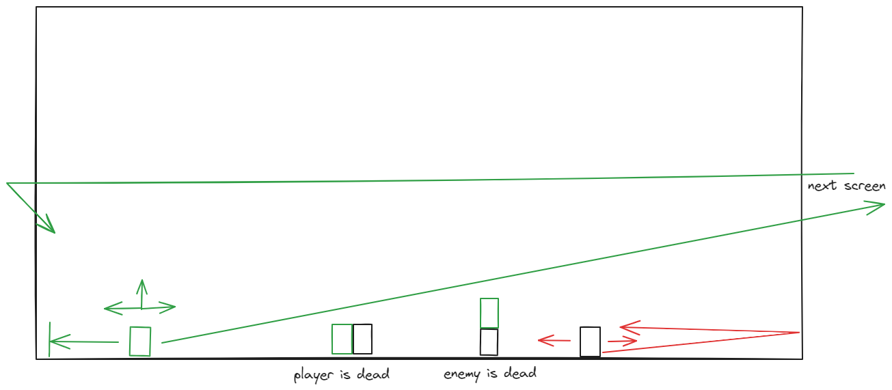

#DEPLOYED PROJECT:
https://thatsmycode.github.io/Kenny-s-DOM-game/

#DOM Platform 2d game

-The player moves side to side, and is able to jump, there are enmys that kill you if they collide lateraly.

- You can kill them by colliding vertically on them (jumping)

- There are multiple levels (screens), each one increase dificulty. You win when you arrive to the last one.

- When you lose the background and audio changes.

##Backlog

- boxes that appear from the top at random horizontal position and fall to the bottom, they act like a wall for the enemys and the player

- boxes( extended box class) that you can interact with

##Presentation

- https://docs.google.com/presentation/d/10U6MFz6EJ7kPNaqTYrNgD6vk-BD628fheTXZi176Mzc/edit?usp=sharing

##Project review

-The game meets the proposed requierements and achieved the backlog features, even tough with a different classes structure, finally the InteractionBox class used for the final door is not an extension of the Box class.

-The game presents a consistency in the themes used, that helps building a story. And the music and sound effects helps the player engage.

-The difficulty (by enemy's frequency and speed) has been carefully balanced in order to present an increassing challenge for each level you advance.

-The game provides with the basic elements that can be easily modified or extended in order to amplify the gaming experience by introducing new elements in future versions.
